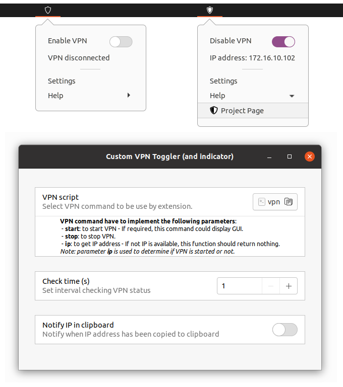

# Custom VPN Toggler

https://extensions.gnome.org/extension/4061/custom-vpn-toggler/

## Gnome Shell extension overview

**Custom VPN Toggler** is a Gnome Shell extension which allow to see the status of a VPN, see IP address associated and permit to start and stop VPN.



## Prerequisite and configuration

Install a VPN and create a command able to start it, stop it and get its IP address (see example bellow).

VPN command have to implement the following parameters:

* **start**: to start VPN - If required, this command could display GUI.
* **stop**: to stop VPN.
* **ip**: to get IP address - If not IP is available, this function should return nothing.

*Note: Parameter **ip** is used to determine if VPN is started or not.*

Configure the command in **Custom VPN Toggler** setting.

### VPN script - Example for netExtender
```bash
#!/bin/bash
if [ -z $1 ]
then
	exit 1
fi

if [ $1 == "start" ]
then
	password=$(zenity --password)
	if [ ! -z ${password} ] 
	then
		kill -9 $(pidof netExtender)
		echo "Y" | netExtender --auto-reconnect -u username -p ${password} -d domain.example.com 999.999.999.999 
	fi
fi

if [ $1 == "stop" ]
then
	kill -9 $(pidof netExtender)
fi

if [ $1 == "ip" ]
then
	ip addr show ppp0 | perl -ne '/(172.\d+.\d+.\d+)/ and print $1'
fi
```

## To do

* Menu: Copy IP Address in clipboard when clicking on menu.
* Menu: Notify that address is available in clipboard.
* Pref: Allow to disable notification when address is copied in clipboard.
 

## License and thanks

This extension is public under [MIT License](LICENSE)

This extension is a derivate work form [wireguard-indicator extension](https://extensions.gnome.org/extension/3612/wireguard-indicator/) created by [atareao](https://extensions.gnome.org/accounts/profile/atareao).